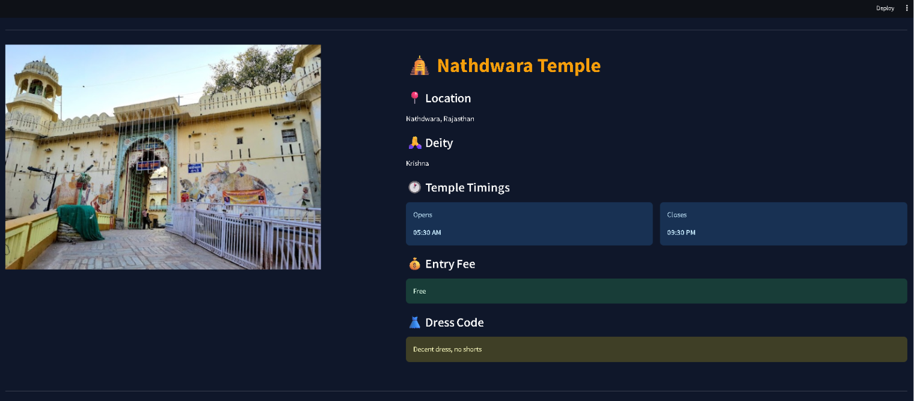
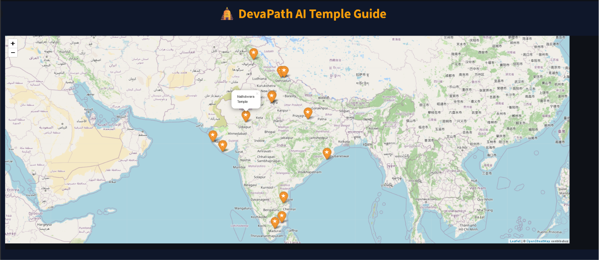

## Project Information
Item	                         Details
Project Title	DevaPath – AI Powered Temple Guide Platform
Group Name	      Team Synergy
Internship	      JSL Works Pvt Ltd Summer Internship Program – 2026
Project Duration	10 June 2026 – 24 July 2026
Team Members	Jahanvi , Abhay Tayal, Aman Bisht

## Declaration

We hereby declare that DevaPath – AI Powered Temple Guide Platform is an original work developed by Team Synergy as part of the JSL Works Pvt Ltd Summer Internship Program – 2026.

By submitting this repository—including the source code, documentation, datasets, presentations, designs, and all associated materials—we confirm that the work has been completed collaboratively by our team unless otherwise acknowledged.

Furthermore, we voluntarily assign and transfer all applicable intellectual property rights, ownership, usage rights, modification rights, and implementation rights associated with this project to JSL Works Pvt Ltd, in accordance with the Summer Internship Program submission policy.

# 🛕 DevaPath – AI Powered Temple Guide Platform

DevaPath is an AI-powered virtual temple guide designed to help users explore famous Indian temples through an intelligent conversational interface.

The application combines Retrieval-Augmented Generation (RAG), Large Language Models (Groq – Llama 3), LangChain, ChromaDB, and interactive maps to provide accurate information about temple history, architecture, deities, festivals, aarti timings, visitor guidelines, and locations.

---

## ✨ Features
🤖 AI-powered Temple Guide (Groq – Llama 3)
📖 Temple History
🛕 Temple Architecture
🙏 Main Deity Information
🎉 Festivals
🪔 Aarti Timings
👗 Traditional Dress Guidelines
📍 Interactive Temple Maps
🌍 GPS Coordinates (OpenStreetMap)
🗄️ ChromaDB Vector Database
🔊 Voice Guide (Text-to-Speech)
⚡ Streamlit Web Application

---

## 🏗️ Project Structure

DevaPath/
│
├── assets/
│   ├── screenshots/
│   ├── temples/
│   ├── logo_temple.png
│   └── shivangi_guide.png
│
├── data/
│   ├── chroma_db/
│   ├── processed/
│   │   ├── temples_master.json
│   │   └── temples_master_fixed.json
│   └── raw/
│
│
├── pages/
│   ├── Explore.py
│   ├── Login.py
│   └── Signup.py
│
├── src/
│   ├── rag/
│   │   └── 05_rag_pipeline.py
│   │
│   └── scrapers/
│       ├── 01_wikipedia_scraper.py
│       ├── 02_timing_scraper.py
│       ├── 03_overpass_fetcher.py
│       └── 04_merge_data.py
│
├── .env
├── .env.example
├── .gitignore
├── app.py
├── database.py
├── guide.mp3
├── LICENSE
├── README.md
├── requirements.txt
├── testdb.py
├── users.db

---

## 🛠️ Technology Stack

Category	         Technology
Language	         Python 3.11
Frontend	         Streamlit
AI Model	         Groq (Llama 3)
Framework	         LangChain
Vector Database      ChromaDB
Web Scraping         BeautifulSoup4, Requests
Maps	               Folium
Location Services	   OpenStreetMap (Overpass API)
Data Storage	   JSON

### 💻 System Requirements

- Python 3.11 or above
- Minimum 8 GB RAM
- Windows 10/11, Linux, or macOS
- Internet Connection
- Groq API Key

---

## 🚀 Installation

### 1. Clone Repository

```bas
git clone https://github.com/Jahanvi-21/Devapath--AI-Temple-Guide.git

cd Devapath-AI Powered Temple Guide Platform
```

### 2. Create Virtual Environment

```bash
python -m venv venv
```

### 3. Activate Virtual Environment

**Windows**
```bash
venv\Scripts\activate
```

**Linux / macOS**
```bash
source venv/bin/activate
```

### 4. Install Required Libraries

```bash
pip install -r requirements.txt
```

---

## 🔑 Configure API Key

Create a `.env` file in the project root:

```env
GROQ_API_KEY=YOUR_GROQ_API_KEY
Get your free API key from: [https://console.groq.com]

OPENWEATHER_API_KEY=your_openweather_api_key
Get your free API key from :[https://openweathermap.org/api]

NEWSAPI_KEY=your_newsapi_key
Get your free API key from: [https://newsapi.org]
```

> **Note:** The `.env` file is intentionally excluded from the repository for security reasons. Users should create their own `.env` file and add a valid `GROQ_API_KEY`.

---

## 📊 Data Collection Workflow

Run the following scripts **in sequence**:

**Step 1 – Scrape Temple History**
```bash
python 01_wikipedia_scraper.py
```

**Step 2 – Collect Aarti Timings**
```bash
python 02_timing_scraper.py
```

**Step 3 – Fetch GPS Coordinates**
```bash
python 03_overpass_fetcher.py
```

**Step 4 – Merge All Data**
```bash
python 04_merge_data.py
```
Creates: `data/processed/temples_master_fixed.json`

**Step 5 – Build Vector Database**
```bash
python 05_rag_pipeline.py
```
Creates embeddings and stores them inside **ChromaDB**.

---

## ▶️ Run the Application

```bash
pip install streamlit
streamlit run app.py
```

The application will start at: `http://localhost:8501`

---

## 🔄 Project Workflow

```
Wikipedia API
     │
Temple Information
     │
Temple Timings
     │    
GPS Coordinates
     │
Merge Dataset
     │
Master JSON
     │
Generate Embeddings
     │
ChromaDB
     │
User Query
     │
RAG Retrieval
     │
Groq (Llama 3)
     │
AI Response
     │
Streamlit Interface
```

---

## 📂 Dataset Contains

🛕 Temple Name
📍 State and Location
🌍 Latitude & Longitude (GPS Coordinates)
🙏 Main Deity
📖 Temple History
🏛️ Architectural Style
🪔 Aarti & Darshan Timings
🎉 Major Festivals and Rituals
👗 Traditional Dress Guidelines
ℹ️ Visitor Guidelines
⭐ Interesting Facts

---

## 🌐 Data Sources

Source	                           Purpose
Wikipedia API	                   Temple History
OpenStreetMap (Overpass API)	       GPS Coordinates
Curated Dataset	                   Temple Timings
Groq API	                         AI Responses

---

## 🤖 AI Capabilities
Retrieval-Augmented Generation (RAG)
Semantic Search
Context-aware Responses
Conversational AI
Question Answering
Fast LLM Inference


---

## # 📸 Screenshots

### 🏠 Home Page


### 🤖 AI Guide


### 🛕 Temple Information


### 🗺️ Interactive Map


### ⏰ Aarti Timing


### ❤️ Devotees Review


### ⭐ Extra Features


### 🔐 Login Page


### 📝 Signup Page


---

## 🚀 Future Enhancements

- 🎙️ AI Talking Avatar
- 👄 Real-Time Lip Synchronization
- 🙌 Gesture Animation
- 🌍 Multi-language Support
- 🔊 Voice -based Conversation
- 📱 Mobile Application
- 🗺️ Temple Route Planner
- ❤️ Personalized Temple Recommendations

---

## 👥 Team Members

Member	                      Responsibilities
Jahanvi 	             AI Integration, LangChain, RAG Pipeline, ChromaDB, Streamlit Development
Abhay Tayal	             Data Collection, Web Scraping, Dataset Preparation
Aman Bisht	             Testing, Documentation, Quality Assurance

## 👨‍💻 Developed By

This project was developed by **Team Synergy** as part of the JSL Works Pvt Ltd Summer Internship Program – 2026.

---

## 📜 License

This project is licensed under the MIT License. See the [LICENSE](LICENSE) file for more information.

---
