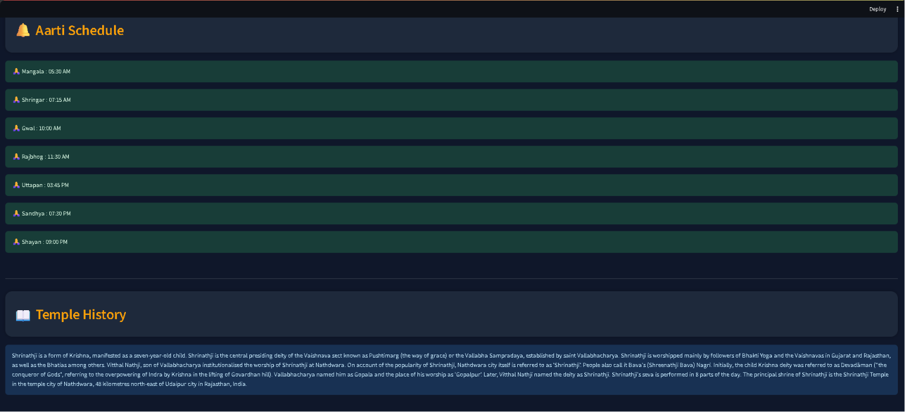

# Declaration
This project, DevaPath – AI Temple Guide, was developed as part of the JSL Works Pvt Ltd Summer Internship Program – 2026.

## Project Information

| Item | Details |
|------|---------|
| Project Title | DevaPath – AI Temple Guide |
| Group Name | Team Synergy |
| Internship Batch | Summer Internship Program – 2026 |
| Project Duration | 10 June 2026 – 15 July 2026 |
| Team Members | Jahanvi, Abhay Tayal, Aman Bisht |

## Declaration of Original Work and Intellectual Property

We hereby declare that this project is an original work undertaken as part of the Summer Internship Program – 2026 at JSL Works Pvt Ltd.

By submitting this project, including the source code, documentation, datasets, presentations, designs, and all associated materials, we confirm that the work has been completed collaboratively by our team unless otherwise acknowledged.

Furthermore, we voluntarily assign and transfer all applicable intellectual property rights, ownership rights, usage rights, modification rights, and implementation rights associated with this project to JSL Works Pvt Ltd, in accordance with the internship submission policy.

We understand and acknowledge that the company may use, reproduce, modify, integrate, distribute, enhance, or commercialize any submitted material for future internal or external projects without limitation, unless otherwise agreed in writing.


# 🛕 DevaPath – AI Temple Guide

DevaPath is an AI-powered virtual temple guide that helps users explore famous Indian temples through an interactive chatbot. The application provides information about temple history, architecture, deities, festivals, aarti timings, visitor guidelines, and location using Artificial Intelligence, Retrieval-Augmented Generation (RAG), and interactive maps.

---

## 📌 Features

- 🤖 AI-powered Temple Guide using Groq (Llama 3)
- 💬 Temple Question Answering Chatbot
- 📖 Temple History
- 🛕 Temple Architecture Information
- 🙏 Main Deity Details
- 🎉 Festivals & Rituals
- 🪔 Aarti Timings
- 👗 Traditional Dress Recommendations
- 📍 Interactive Temple Map
- 🌍 GPS Coordinates using OpenStreetMap
- 🔍 RAG-based Information Retrieval
- 🗄️ ChromaDB Vector Database
- 🖼️ Temple Images
- 🔊 Voice Guide (Text-to-Speech)
- ⚡ Streamlit Web Application

---

# 🏗️ Project Structure

```text
DevaPath/
│
├── assets/
│   ├── screenshots/
│   │   ├── ai_guide.png
│   │   ├── interactive_map.png
│   │   ├── temple_info.png
│   │   └── timingandhistory.png
│   ├── temples/
│   │   ├── badrinathtemple.webp
│   │   ├── brihadeshwaratemple.jpg
│   │   ├── dwarakadheeshtemple.webp
│   │   ├── kashi-vishwanath.webp
│   │   ├── kedarnathtemple.jpg
│   │   ├── Lord-Shree-Jagannth-Temple.png
│   │   ├── Mata-Vaishno-DeviTemple.webp
│   │   ├── meenakshitemple.png
│   │   ├── shrikrishnajanambhoomitempless.jpg
│   │   ├── Shrinathji_Temple.jpg
│   │   ├── somnathtemple.webp
│   │   └── tirupatibalaji.webp
│   └── shivangi_guide.png
│
├── data/
│   ├── raw/
│   ├── processed/
│   └── chroma_db/
│
├── docs/
├── src/
├── rag/
│   └── 05_rag_pipeline.py
│
├── scrapers/
│   ├── 01_wikipedia_scraper.py
│   ├── 02_timing_scraper.py
│   ├── 03_overpass_fetcher.py
│   └── 04_merge_data.py
│
├── utils/
│   ├── test_embed.py
│   └── voicetest.py
│
├── .env.example
├── .gitignore
├── app.py
├── guide.mp3
├── LICENSE
├── README.md
└── requirements.txt
```

# 🛠️ Technology Stack

| Category | Technology |
|----------|------------|
| Programming Language | Python 3.11 |
| Frontend | Streamlit |
| AI Model | Groq (Llama 3) |
| AI Framework | LangChain |
| Vector Database | ChromaDB |
| Web Scraping | BeautifulSoup4, Requests |
| Maps | Folium |
| Location API | OpenStreetMap (Overpass API) |
| Data Format | JSON |

## 💻 System Requirements

- Python 3.11 or above
- Minimum 8 GB RAM
- Windows 10/11, Linux, or macOS
- Internet Connection
- Groq API Key
---

# 🚀 Installation

## 1. Clone Repository

```bash
git clone https://github.com/your-username/devapath.git

cd devapath
```

---

## 2. Create Virtual Environment

```bash
python -m venv venv
```

---

## 3. Activate Virtual Environment

### Windows

```bash
venv\Scripts\activate
streamlit run app.py
```
### Linux / macOS

```bash
source venv/bin/activate
```

---

## 4. Install Required Libraries

```bash
pip install -r requirements.txt
```

---

# 🔑 Configure API Key

Create a `.env` file in the project root.

```env
GROQ_API_KEY=YOUR_GROQ_API_KEY
```

Get your free API key from:

https://console.groq.com

> **Note:**
> The `.env` file is intentionally excluded from the repository for security reasons.
> Users should create their own `.env` file and add a valid `GROQ_API_KEY`.

---

# 📊 Data Collection Workflow

Run the following scripts **in sequence**.

### Step 1 – Scrape Temple History

```bash
python 01_wikipedia_scraper.py
```

---

### Step 2 – Collect Aarti Timings

```bash
python 02_timing_scraper.py
```

---

### Step 3 – Fetch GPS Coordinates

```bash
python 03_overpass_fetcher.py
```

---

### Step 4 – Merge All Data

```bash
python 04_merge_data.py
```

Creates:

```
data/processed/temples_master.json
```

---

### Step 5 – Build Vector Database

```bash
python 05_rag_pipeline.py
```

Creates embeddings and stores them inside **ChromaDB**.

---

# ▶️ Run the Application

Install Streamlit (if not installed).

```bash
pip install streamlit
```

Run the project.

```bash
streamlit run app.py
```

The application will start at:

```
http://localhost:8501
```

---

# 🔄 Project Workflow

```
Wikipedia API
      │
      ▼
Temple History
      │
Temple Timings
      │
GPS Coordinates
      │
Merge Dataset
      │
Generate Master JSON
      │
Generate Embeddings
      │
Store in ChromaDB
      │
User Query
      │
Relevant Context Retrieval
      │
Groq (Llama 3)
      │
AI Response
      │
Streamlit Interface
```

---

# 📂 Dataset Contains

- Temple Name
- Temple History
- Main Deity
- Architecture
- State
- Latitude
- Longitude
- Aarti Timings
- Festivals
- Traditional Dress
- Interesting Facts
- Visitor Guidelines

---

# 🌐 Data Sources

| Source | Purpose |
|---------|----------|
| Wikipedia API | Temple History |
| OpenStreetMap (Overpass API) | GPS Coordinates |
| Manual Dataset | Aarti Timings |
| Groq API | AI Responses |

---

# 🤖 AI Features

- Conversational Temple Guide
- Retrieval-Augmented Generation (RAG)
- Semantic Search
- Context-Aware Responses
- AI Question Answering
- Fast Inference with Groq

---

# 📸 Screenshots

## Home Page


## Temple Information


## Interactive Map


## Aarti Timing And History


---

# 🚀 Future Enhancements

- 🎙️ AI Talking Avatar
- 👄 Real-Time Lip Synchronization
- 🙌 Hand Gesture Animation
- 🌍 Multi-language Support
- 🔊 Voice Conversation
- 📱 Mobile Application
- 🗺️ Temple Route Planner
- ❤️ Personalized Temple Recommendations

---

# 👥 Team Members

| Name | Responsibilities |
|------|------------------|
| **Jahanvi** | AI Integration, LangChain, RAG Pipeline, ChromaDB Integration, Streamlit Development |
| **Abhay Tayal** | Web Scraping, Data Collection, Data Processing, Dataset Preparation |
| **Aman Bisht** | Testing, Documentation, UI Validation, Quality Assurance |

# 👨‍💻 Developed By

This project was developed by Team Synergy as part of the JSL Works Pvt Ltd Summer Internship Program – 2026.
---

# 📜 License

This project is licensed under the MIT License.

See the LICENSE file for more information.